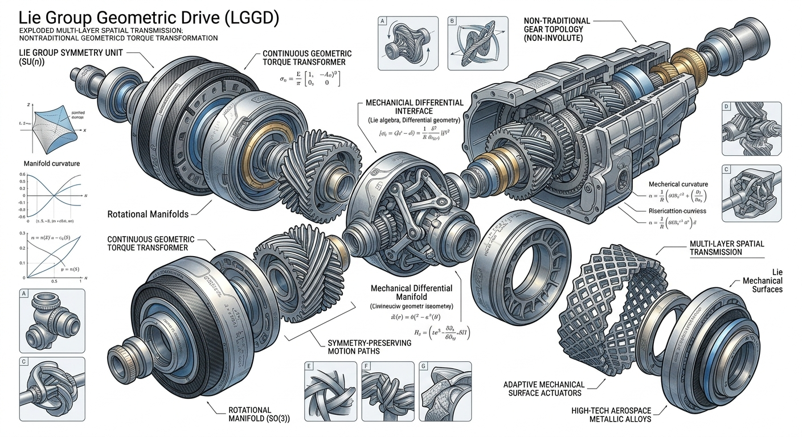

# Lie-Geometry Inspired Mechanical Structures

> Explorations in geometric mechanics, manifold-driven transmission systems, symmetry-preserving motion structures, and Lie-group-inspired kinematic architectures.

## Geometry-Inspired Transmission Concept

<p align="center">
  
</p>

---

## Overview

This repository explores conceptual mechanical systems inspired by:

* Lie groups and Lie algebras
* Differential geometry
* Manifold-constrained motion
* Symmetry-preserving kinematics
* Geometric transmission theory
* Spatial mechanical topology

The goal is **not** to directly propose industrial products or manufacturable gearboxes, but rather to investigate:

> Whether advanced geometric structures can inspire future mechanical architectures, robotic joints, adaptive transmissions, and novel motion systems.

This project sits at the intersection of:

| Mathematics           | Mechanics            | AI                            |
| --------------------- | -------------------- | ----------------------------- |
| Lie groups            | Kinematics           | Structure generation          |
| Differential geometry | Transmission systems | Generative design             |
| Manifolds             | Spatial mechanisms   | AI-assisted concept discovery |
| Symmetry theory       | Motion constraints   | Geometric optimization        |

---


# Motivation

Modern mechanical systems are still largely dominated by:

* fixed gear topologies
* Euclidean motion assumptions
* rigid transmission structures
* manually designed kinematic chains

However, many advanced systems naturally exhibit:

* nonlinear motion manifolds
* symmetry-preserving dynamics
* adaptive geometric constraints
* topology-driven transformations

This repository explores whether:

# Geometry itself can become a transmission language.

---

# Core Ideas

## 1. Lie-Group-Inspired Motion

Mechanical motion can often be represented by transformation groups such as:

[
SO(3), \quad SE(3)
]

instead of purely linear coordinate systems.

Potential implications include:

* adaptive rotational structures
* continuous geometric torque mapping
* manifold-based motion transitions
* symmetry-preserving transmission paths

---

## 2. Manifold-Constrained Transmission

Traditional gear systems use discrete gear ratios.

This project explores:

* continuous geometric transmission
* curvature-driven motion paths
* non-Euclidean rotational mappings
* spatially adaptive torque flow

---

## 3. Symmetry-Preserving Kinematics

Many mechanical systems contain hidden geometric symmetries.

Possible benefits of symmetry-aware structures include:

* reduced vibration
* smoother motion transfer
* lower mechanical redundancy
* improved structural compactness

---

## 4. Geometric Mechanical Compression

Inspired by ideas from:

* structural pruning
* manifold optimization
* geometric equivalence

this repository also investigates:

> whether mechanical systems can be simplified through geometric degree-of-freedom reduction.

---

# Repository Structure

```text
/
├── concepts/
│   ├── manifold_transmission/
│   ├── symmetry_gear_systems/
│   ├── geometric_differentials/
│   └── adaptive_spatial_mechanics/
│
├── diagrams/
│   ├── exploded_views/
│   ├── kinematic_sketches/
│   └── motion_manifolds/
│
├── notes/
│   ├── lie_groups_in_mechanics.md
│   ├── manifold_kinematics.md
│   └── symmetry_constraints.md
│
├── simulations/
│   └── future_work/
│
└── README.md
```

---

# Current Status

This repository currently contains:

* conceptual mechanical diagrams
* theoretical geometric interpretations
* exploratory kinematic structures
* AI-assisted visual prototypes

Most designs are:

* exploratory
* theoretical
* non-manufacturable at present
* intended for structural inspiration and discussion

---

# Important Disclaimer

This project is a conceptual and theoretical exploration.

It is **NOT**:

* a production-ready transmission design
* a validated engineering gearbox
* an industrial mechanical solution
* a certified automotive component

The diagrams and structures are intended to stimulate discussion around:

* geometric mechanics
* advanced kinematic systems
* manifold-based motion representations
* future transmission concepts

Engineering validation would require:

* CAD modeling
* finite element analysis
* kinematic verification
* tribology analysis
* manufacturing feasibility studies
* material engineering

---

# Why Open Source?

This repository is shared openly to encourage:

* interdisciplinary discussion
* geometric thinking in mechanics
* structure-driven mechanical exploration
* collaboration between mathematics and engineering

Potentially relevant communities include:

* robotics
* mechanism design
* geometric control
* aerospace systems
* AI-assisted engineering
* spatial kinematics

---

# Future Directions

Potential future explorations include:

* manifold-based robotic joints
* symmetry-aware gear systems
* adaptive geometric differentials
* geometric torque transformers
* Lie-group motion planners
* topology-constrained mechanisms
* AI-generated kinematic structures

---

# Author Perspective

This repository reflects an ongoing curiosity about:

> whether geometry and symmetry can serve as foundational design principles for future mechanical systems.

The work is intentionally exploratory and interdisciplinary.

---

# License

MIT License

---

# Keywords

Lie groups • Differential geometry • Mechanical manifolds • Spatial kinematics • Geometric transmission • Symmetry-preserving motion • Manifold mechanics • Non-Euclidean mechanics • AI-assisted mechanism design
